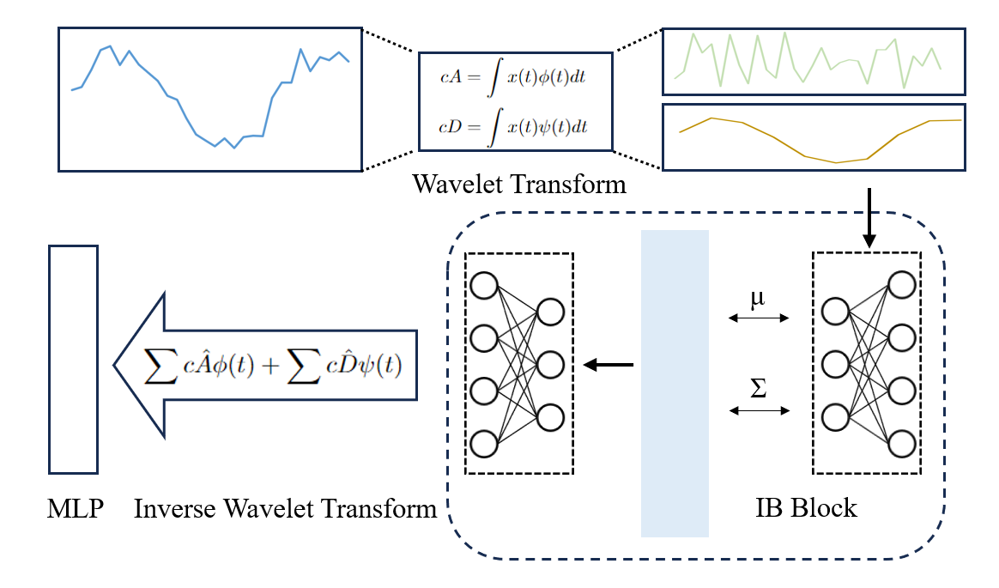

# TimeSieve: Extracting Temporal Dynamics through Information Bottlenecks

[Ninghui Feng*](https://github.com/feng1201), [Songning Lai*](https://github.com/xll0328/), Zhenxiao Yin, Fobao Zhou, Hang Zhao†

[](https://NA) [](https://NA)  [](https://arxiv.org/NA)  

## Abstract
In this paper, we present TimeSieve, a pioneering time series forecasting model that innovatively applies Information Bottleneck Theory from an information-theoretic perspective to analyze and interpret time series data. TimeSieve integrates wavelet transformations to adeptly decompose the input data into multi-scale components, enhancing the model's ability to handle complex datasets. By employing an IB module, TimeSieve meticulously filters and retains only the most pivotal information, significantly reducing computational overhead and markedly improving generalization across diverse contexts. This methodological synergy addresses the perennial challenges in time series analysis, such as the efficient capture of abrupt temporal changes and the reduction of noise interference. The resulting framework not only streamlines the forecasting process but also bolsters its performance and applicability in real-world scenarios.

## Motivation
Despite these advancements, these models still face challenges such as high computational demands, limited generalization across diverse scenarios, and insufficient robustness in capturing local abrupt changes. Moreover, models like Autoformer and TSMixer struggle to effectively distinguish signal from noise in datasets characterized by strong seasonality and random noise, particularly when traditional autocorrelation mechanisms break down due to noise interference.

## Our Approach TimeSieve

<p align="center">
  
</p>

In this study, we propose a novel time series forecasting model named TimeSieve. This model integrates the Information Bottleneck (IB) method with wavelet transform technology to enhance the accuracy and robustness of time series predictions. 

To effectively capture comprehensive feature information, we employ the Wavelet Decomposition Block (WDB). The WDB decomposes time series data into different frequency components, effectively extracting multi-scale information. Specifically, the wavelet transform can be represented by the following equations:

\begin{equation}
c\hat A = IFCB(cA)
\end{equation}
\begin{equation}
c\hat D = IFCB(cD)
\end{equation}
where $c\hat A $ and $c\hat D $ represents the filtered coefficients $cA$ and $cD$.

After filtering with the IFCB, we apply the Wavelet Reconstruction Block (WRB) to reconstruct the processed data back into the time domain. This step ensures that the features at different scales are fully utilized. Finally, we use a Multi-Layer Perceptron (MLP) as the predictor to make the final forecast on the processed time series data. The equations for the prediction step are as follows:
\begin{equation}
Y = MLP(WRB([c\hat A, c\hat D]))
\end{equation}

The overall architecture of the TimeSieve model is illustrated in Figure 1. The TimeSieve model leverages the combination of wavelet transform and Information Bottleneck methods to effectively handle the multi-scale characteristics and noise present in time series data, thereby improving the model's predictive performance and robustness. This approach is motivated by the need to optimize information flow and enhance feature extraction, ensuring that our model can make accurate and reliable predictions across various applications.

**WDB and WRB**. 

**IFCB**.

**Final Loss Function**.

\begin{equation}
\begin{aligned}
\text{loss} &= \text{loss}_o + \text{loss}_{IB} \\
            &= \text{loss}_o + D_{KL}[\mathcal{N}(\mu_z, \Sigma_z) \,||\, \mathcal{N}(0, I)] + D_{KL}[p(z) \,||\, p(z|i)]
\end{aligned}
\end{equation}
Where 
\(\text{loss}_o\)
  is the original loss, typically representing the error in regression predictions, and 
\(\text{loss}_{IB}\)is the information bottleneck loss.
    
## How to Use the Code

* [1. Setup and Installation](#setup)

* [2.Dependencies](#Dependencies)

* [3. Quick Start](#quickstart)

* [4. Datasets](#datasets)

* [4. Train](#train)

* [5. Evaluation](#eval)

* [6. Acknowledgments](#acknowledgements)

<!--
## Setup and Installation <a name="setup"></a>


Clone the repository: 

```shell
git clone https://github.com/sato-team/Stable-Text-to-motion-Framework.git
```

Create fresh conda environment and install all the dependencies:

```
conda env create -f environment.yml
conda activate SATO
```

The code was tested on Python 3.8 and PyTorch 1.8.1.

## Dependencies<a name="Dependencies"></a>

```shell
bash dataset/prepare/download_extractor.sh
bash dataset/prepare/download_glove.sh
```

## **Quick Start**<a name="quickstart"></a>

A quick reference guide for using our code is provided in quickstart.ipynb.

## Datasets<a name="datasets"></a>

We are using two 3D human motion-language dataset: HumanML3D and KIT-ML. For both datasets, you could find the details as well as download [link](https://github.com/EricGuo5513/HumanML3D).
We perturbed the input texts based on the two datasets mentioned. You can access the perturbed text dataset through the following [link](https://drive.google.com/file/d/1XLvu2jfG1YKyujdANhYHV_NfFTyOJPvP/view?usp=sharing).
Take HumanML3D for an example, the dataset structure should look like this:  
```
./dataset/HumanML3D/
├── new_joint_vecs/
├── texts/ # You need to replace the 'texts' folder in the original dataset with the 'texts' folder from our dataset.
├── Mean.npy 
├── Std.npy 
├── train.txt
├── val.txt
├── test.txt
├── train_val.txt
└── all.txt
```
### **Train**<a name="train"></a>

We will release the training code soon.

### **Evaluation**<a name="eval"></a>

You can download the pretrained models in this [link](https://drive.google.com/drive/folders/1rs8QPJ3UPzLW4H3vWAAX9hJn4ln7m_ts?usp=sharing). 

```shell
python eval_t2m.py --resume-pth pretrained/vq_best.pth --resume-trans pretrained/net_best_fid.pth --clip_path pretrained/clip_best.pth
```


## Acknowledgements<a name="acknowledgements"></a>

We appreciate helps from :

- Open Source Code：[T2M-GPT](https://github.com/Mael-zys/T2M-GPT), [MoMask ](https://github.com/EricGuo5513/momask-codes), [MDM](https://guytevet.github.io/mdm-page/), etc.
- [Hongru Xiao](https://github.com/Hongru0306), [Erhang Zhang](https://github.com/zhangerhang), [Lijie Hu](https://sites.google.com/view/lijiehu/homepage), [Lei Wang](https://leiwangr.github.io/), [Mengyuan Liu](), [Chen Chen](https://www.crcv.ucf.edu/chenchen/) for discussions and guidance throughout the project, which has been instrumental to our work.
- [Zhen Zhao](https://github.com/Zanebla) for project website.
- If you find our work helpful, we would appreciate it if you could give our project a star!
## Citing<a name="citing"></a>
-->


If you find this document useful for your research, please consider citing the following repository, and our full paper and code will coming soon (2024.06):

@misc{githubrepo,
  author       = "{GitHub Username}",
  title        = "{Repository Name}",
  howpublished = "{GitHub repository}",
  note         = "{URL: \url{https://github.com/{username}/{repository}}}",
  year         = {Year},
}

```bibtex
@misc{TimeSieve_repo,
  author       = "{Ninghui Feng and Songning Lai and Zhenxiao Yin and Fobao Zhou and Hang Zhao}",
  title        = "{TimeSieve: Extracting Temporal Dynamics through Information Bottlenecks}",
  howpublished = "{GitHub repository}",
  note         = "{URL: \url{https://github.com/xll0328/TimeSieve/}}",
  year         = {2024},
}
```

