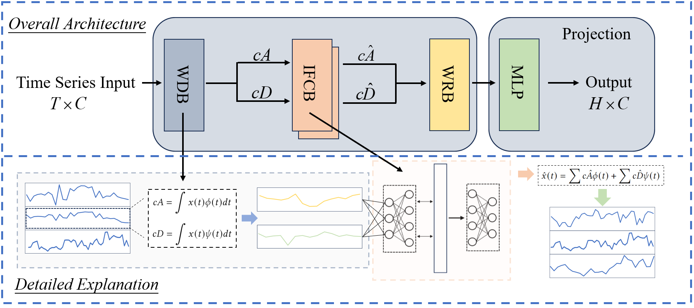

# TimeSieve: Extracting Temporal Dynamics through Information Bottlenecks

[Ninghui Feng*](https://github.com/feng1201), [Songning Lai*](https://github.com/xll0328/), Fobao Zhou, Zhenxiao Yin, Hang Zhao†

[](https://NA) [](https://NA)  [](https://arxiv.org/NA)  

## Abstract
Time series forecasting has become an increasingly popular research area due to its critical applications in various real-world domains such as traffic management, weather prediction, and financial analysis. Despite significant advancements, existing models face notable challenges, including the necessity of manual hyperparameter tuning for different datasets, and difficulty in effectively distinguishing signal from redundant features in data characterized by strong seasonality. These issues hinder the generalization and practical application of time series forecasting models. To solve this issues, we propose an innovative time series forecasting model - **TimeSieve** designed to address these challenges. Our approach employs wavelet transforms to preprocess time series data, effectively capturing multi-scale features without the need for additional parameters or manual hyperparameter tuning. Additionally, we introduce the information bottleneck theory that filters out redundant features from both detail and approximation coefficients, retaining only the most predictive information. This combination reduces significantly improves the model's accuracy. Extensive experiments demonstrate that our model outperforms existing state-of-the-art methods on 70% of the datasets, achieving higher predictive accuracy and better generalization across diverse datasets. Our results validate the effectiveness of our approach in addressing the key challenges in time series forecasting, paving the way for more reliable and efficient predictive models in practical applications.

## Motivation
Existing models often require the introduction of additional parameters to capture multi-scale features, which increases computational complexity. Moreover, these models necessitate manual tuning of hyperparameters for different datasets, further complicating their application and limiting their generalization across diverse scenarios. More importantly, many models, including Autoformer, struggle to effectively distinguish between signal and redundant features when dealing with data characterized by strong seasonality. Redundant features not only interferes with the learning process, leading to increased errors, but also obscures the true patterns within the data, making the predictions unreliable. This issue is particularly pronounced when traditional autocorrelation mechanisms break down due to redundant features interference, significantly diminishing the practical value of these models.

## Contributions
- We introduce WDB and WRB that efficiently capture multi-scale features in time series data without requiring manual hyperparameter tuning or the introduction of additional parameters.
- We utilize an information-theoretic approach by incorporating an IFCB to filter out redundant features from the data. This ensures that only the most predictive features are retained, enhancing the model's accuracy.
- By integrating wavelet transforms for comprehensive feature extraction and the information bottleneck block for redundant features, our model achieves state-of-the-art performance on 70% of the datasets tested, demonstrating superior predictive accuracy and generalization across diverse scenarios.

## Our Approach TimeSieve

<p align="center">
  
</p>

In our study, we propose a novel time series forecasting model named **TimeSieve**. This model integrates the Information Filtering and Compression Block (IFCB) with wavelet transform technology to enhance the accuracy of time series predictions. 

To effectively capture comprehensive feature information, we employ the Wavelet Decomposition Block (WDB). The WDB decomposes time series data into different frequency components, effectively extracting multi-scale information. Specifically, the wavelet transform can be represented by the following equations:

$[cA,cD] = WDB(X)$

where the approximation coefficients $cA$ representing the low-frequency trends, and the detail coefficients $cD$ representing the high-frequency details.

However, the extracted multi-scale information may contain redundant features, which can adversely affect the model's learning performance and predictive accuracy. To address this issue, we introduce the Information Filtering and Compression Block (IFCB) to filter the information. Additionally, we employ residual connections to ensure that valuable information is not lost during the filtering process. The IFCB optimizes the information flow, retaining critical information while filtering out irrelevant or redundant information. The equations for the Information Bottleneck module are as follows:

$c\hat A = IFCB(cA)+cA$

$c\hat D = IFCB(cD)+cD$

where $c\hat A$ and $c\hat D$ represents the filtered coefficients $cA$ and $cD$.

After filtering with the IFCB, we apply the Wavelet Reconstruction Block (WRB) to reconstruct the processed data back into the time domain. This step ensures that the features at different scales are fully utilized. Finally, we use a Multi-Layer Perceptron (MLP) as the prediction to make the final forecast on the processed time series data. The equation for the prediction step is as follows:

$Y = MLP(WRB([c\hat A, c\hat D]))$


The TimeSieve model leverages the combination of wavelet transform and Information Bottleneck methods to effectively handle the multi-scale characteristics and noise present in time series data, thereby improving the model's predictive performance and robustness. This approach is motivated by the need to optimize information flow and enhance feature extraction, ensuring that our model can make accurate and reliable predictions across various applications.

The overall architecture of the TimeSieve model is illustrated in Figure 1. The TimeSieve model leverages the combination of wavelet transform and IFCB to effectively handle the multi-scale characteristics present in time series data, thereby improving the model's predictive performance. This approach is motivated by the need to optimize information flow and enhance feature extraction, ensuring that our model can make accurate and reliable predictions across various applications. 

The above is an overall description of TimeSieve. We will provide a detailed introduction to WDB, WRB, and IFCB in the following sections.

### WDB and WRB 

To effectively capture comprehensive feature information, we employ wavelet transformation to decompose time series data, allowing us to analyze the data across multiple scales. Wavelet transformation allows us to break down the data into various frequency components, enabling us to analyze and extract features across multiple temporal scales. This multi-scale analysis is crucial for identifying patterns and trends that occur at different time resolutions.

**WDB.** For the input time series $x(t)\in\mathbb{R}^{T\times C}$, where $T$ represents the length of the lookback window and $C$ denotes the number of variates, the wavelet transform decomposes the series into approximation coefficients $cA$ and detail coefficients $cD$. The approximation coefficients $\(cA\)$ capture the general trend or smooth component of the series, representing low-frequency information. In contrast, the detail coefficients $\(cD\)$ capture the fine-grained, high-frequency information, highlighting local fluctuations and details within the series. This decomposition can be expressed as:

$cA = \int x(t) \phi(t) dt$

$cD = \int x(t) \psi(t) dt$

where $\( \phi(t) \)$ and $\( \psi(t) \)$ are the scaling function and wavelet function, respectively, defined as follows:

$\phi(x) = \sum_{k=0}^{N-1} a_k \phi(2u - k),$

$\psi(x) = \sum_{k=0}^{M-1} b_k \phi(2u - k),$

In the case of db1 wavelet transform, $\( \phi(t) \)$ represents the low-pass filter, capturing the smooth, approximate part of the signal, and $\( \psi(t) \)$ represents the high-pass filter, capturing the detailed, high-frequency part of the signal. Here, $\( a_k \)$ and $\( b_k \)$ are the filter coefficients for the scaling and wavelet functions, respectively, $\( u \)$ is the variable over which the functions are defined, and $\( k \)$ is the index of the coefficients.

This decomposition allows the model to capture different characteristics of the data at various levels, thereby optimizing the understanding and prediction of time series dynamics, particularly in identifying local features within the series.

**WRB.** After the wavelet transformation, the detail and approximation coefficients are processed through IFCB to preserve the most predictive information. Subsequently, the inverse wavelet transform is applied to reconstruct the time series from the processed coefficients:

$\hat{x}(t) = \sum c\hat{A} \phi (t) + \sum c\hat{D} \psi (t)$

where $\(c\hat{A} \)$ and $\(c\hat{D} \)$ are the filtered approximation and detail coefficients, respectively. Finally, the reconstructed time series is passed through a MLP for final prediction.


### IFCB

Motivated by the need to effectively filter out redundant features while retaining critical information, we introduce the Information Filtering and Compression Block (IFCB), inspired by the information bottleneck principle. In this section, we process the detail coefficients $\(cD\)$ and approximation coefficients \(cA\) from the wavelet transform of the time series data, for convenience in subsequent explanations, we define $cI \in (cA,cD)$  to collectively represent $cA$ and $cD$.  Additionally, We use \( c\hat{I} \), where \( I \) is in the range \([A, D]\). to represent \(c\hat{A} \) and \(c\hat{D} \), the filtered versions of \(cA\) and \(cD\). Initially, we define the input to the IFCB as \(cI \in \mathbb{R}^{T/2 \times C}\) and the output to the IFCB as \(c\hat{I} \in \mathbb{R}^{T/2 \times C}\).

In our model, both \(cI\) and \(c\hat I\) are treated as random variables with a joint distribution \(p(i, \hat i)\). The mutual information between them, denoted as \(I(cI; c\hat I)\), quantifies the amount of information shared by \(cI\) and \(c\hat I\) (More details you can see in Appendix \ref{MI}). It is defined as:

$1(cI; c\hat I)&=D_{kL}[p(i, \hat i)\|p(i)p(\hat i)]$

We define the intermediate hidden layer random variable \(Z\). Following the principles of a Markov chain where \(cI \rightarrow Z \rightarrow c \hat I\), the mutual information satisfies \(I(cI; Z) \geq I(cI; c \hat I)\) (More details see in Appendix \ref{MCT}). Although there is an inevitable information loss in the transmission to the middle layer \(Z\), the key is that \(Z\) retains the most critical information for predicting \(c \hat I\) while filtering out irrelevant features.

This allows us to define the objective of IFCB, which is to maximize the mutual information between \(Z\) and \(c \hat I\) while minimizing the information between \(Z\) and \(cI\).

$\min \{I(cI; Z) - \beta I(Z; c \hat I)\}$

where \(\beta\) is a trade-off parameter that determines the weight of the minimal information constraint in the optimization process.

The optimization is carried out using a deep neural network, which is designed to minimize the above objective by adjusting the network weights and biases through backpropagation and suitable regularization techniques.

Optimization is then performed using a deep neural network. Assuming \(p(z|i)\)  follows a Gaussian distribution, we can derive the following:

$$
\begin{aligned}p(z|i) &= \mathcal{N}(\mu(i;\theta_\mu), \Sigma(i;\theta_\Sigma)) \\
         &= \mathcal{N}(\mu_z, \Sigma_z)\end{aligned}
$$

where \( \theta_\mu\)  and \(\theta_\Sigma \)  are the parameters of the networks that are optimized during training. 

Parameter updates pose a challenge due to the stochastic nature of the gradient calculations. To address this, the reparameterization trick is introduced. The formula is given as:

$z=\mu_z+\Sigma_z\times\epsilon$

where \(\epsilon \)  is sampled from a standard Gaussian distribution.

Given that the study focuses on a regression task, we define the conditional probability \(q(\hat i|z)\) as follows:

$q(\hat i|z)=e^{-||\hat i-D(z;\theta_c)||}+C$

where \(D\) is a decoder function parameterized by \(\theta_c\), and \(C\) is a constant. This formulation measures the fit of the model's predictions by capturing the deviation of the predicted output \(\hat i\) from the output of the decoder.

We now specify the model's loss function. This function is crucial for training the model to minimize prediction errors and optimize the distribution parameters effectively. The loss is composed of the original loss component and the IFCB loss, as shown below:


$$
\begin{aligned}
\ell &=  \ell_{o} +  \ell_{IB}\\
&=  \ell_{o} +  D_{KL}[\aleph(\mu_z, \Sigma_z) \,||\, \aleph(0, I)] + D_{KL}[p(z) \,||\, p(z|i)]
\end{aligned}
$$

where $\ell_{o}$ is the original loss, typically representing the error in regression predictions, and $\ell_{IB}$ is the information bottleneck loss.
    
## How to Use the Code

* [1. Setup and Installation](#setup)

* [2.Dependencies](#Dependencies)

* [3. Quick Start](#quickstart)

* [4. Datasets](#datasets)

* [4. Train](#train)

* [5. Evaluation](#eval)

* [6. Acknowledgments](#acknowledgements)

<!--
## Setup and Installation <a name="setup"></a>


Clone the repository: 

```shell
git clone https://github.com/sato-team/Stable-Text-to-motion-Framework.git
```

Create fresh conda environment and install all the dependencies:

```
conda env create -f environment.yml
conda activate SATO
```

The code was tested on Python 3.8 and PyTorch 1.8.1.

## Dependencies<a name="Dependencies"></a>

```shell
bash dataset/prepare/download_extractor.sh
bash dataset/prepare/download_glove.sh
```

## **Quick Start**<a name="quickstart"></a>

A quick reference guide for using our code is provided in quickstart.ipynb.

## Datasets<a name="datasets"></a>

We are using two 3D human motion-language dataset: HumanML3D and KIT-ML. For both datasets, you could find the details as well as download [link](https://github.com/EricGuo5513/HumanML3D).
We perturbed the input texts based on the two datasets mentioned. You can access the perturbed text dataset through the following [link](https://drive.google.com/file/d/1XLvu2jfG1YKyujdANhYHV_NfFTyOJPvP/view?usp=sharing).
Take HumanML3D for an example, the dataset structure should look like this:  
```
./dataset/HumanML3D/
├── new_joint_vecs/
├── texts/ # You need to replace the 'texts' folder in the original dataset with the 'texts' folder from our dataset.
├── Mean.npy 
├── Std.npy 
├── train.txt
├── val.txt
├── test.txt
├── train_val.txt
└── all.txt
```
### **Train**<a name="train"></a>

We will release the training code soon.

### **Evaluation**<a name="eval"></a>

You can download the pretrained models in this [link](https://drive.google.com/drive/folders/1rs8QPJ3UPzLW4H3vWAAX9hJn4ln7m_ts?usp=sharing). 

```shell
python eval_t2m.py --resume-pth pretrained/vq_best.pth --resume-trans pretrained/net_best_fid.pth --clip_path pretrained/clip_best.pth
```


## Acknowledgements<a name="acknowledgements"></a>

We appreciate helps from :

- Open Source Code：[T2M-GPT](https://github.com/Mael-zys/T2M-GPT), [MoMask ](https://github.com/EricGuo5513/momask-codes), [MDM](https://guytevet.github.io/mdm-page/), etc.
- [Hongru Xiao](https://github.com/Hongru0306), [Erhang Zhang](https://github.com/zhangerhang), [Lijie Hu](https://sites.google.com/view/lijiehu/homepage), [Lei Wang](https://leiwangr.github.io/), [Mengyuan Liu](), [Chen Chen](https://www.crcv.ucf.edu/chenchen/) for discussions and guidance throughout the project, which has been instrumental to our work.
- [Zhen Zhao](https://github.com/Zanebla) for project website.
- If you find our work helpful, we would appreciate it if you could give our project a star!
## Citing<a name="citing"></a>
-->


If you find this document useful for your research, please consider citing the following repository, and our full paper and code will coming soon (2024.06):
```bibtex
@misc{TimeSieve_repo,
  author       = "{Ninghui Feng and Songning Lai and Zhenxiao Yin and Fobao Zhou and Hang Zhao}",
  title        = "{TimeSieve: Extracting Temporal Dynamics through Information Bottlenecks}",
  howpublished = "{GitHub repository}",
  note         = "{URL: \url{https://github.com/xll0328/TimeSieve/}}",
  year         = {2024},
}
```

